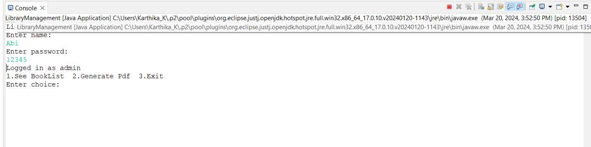
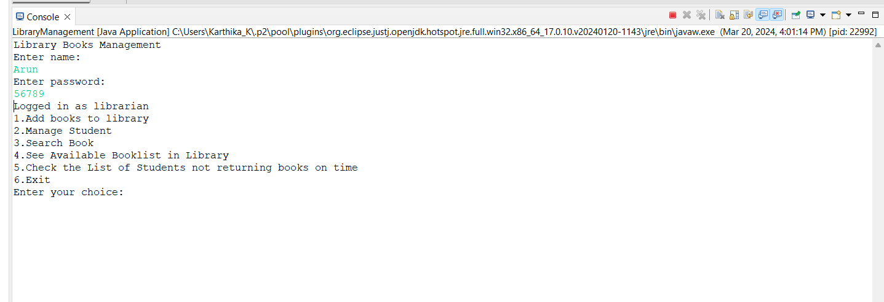
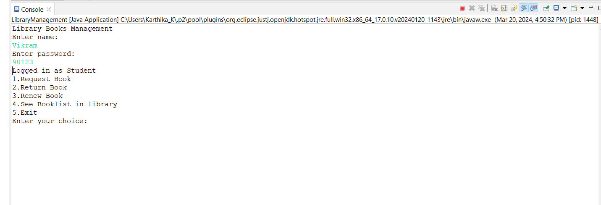
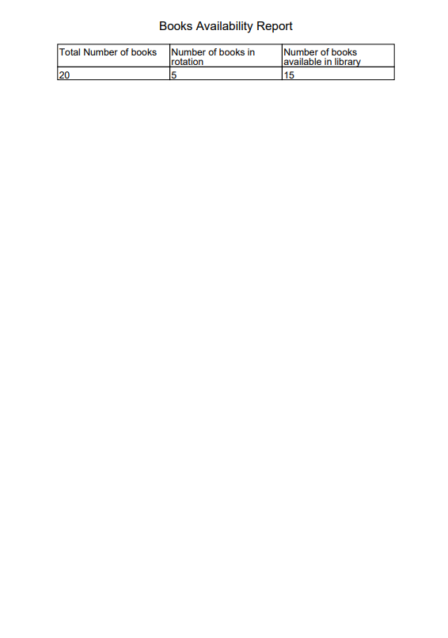

# Library Management System
 
## Overview
 
The Library Management System is a simple software application and it is console-based designed to manage library tasks efficiently. It provides functionalities to add new books, manage students such as add, modify, block or remove a student, search book, check book status, get the list of students not returning books on time and generate report.
 
### Roles
 
1. **Admin**: Oversee the overall functioning of the library system, manage books and generate reports.
2. **Librarian**: Responsible for day-to-day management of library operations, including adding new books, managing students, 				 		           handling book requests, and maintaining the availability of books.
3. **Student**: Responsible for requesting books, returning and renewing books.

### Key Features
 
- **Add New Books to Library**: Librarians can add new books to the library, providing details such as title, author, publish year, keyword, etc.
- ** Manage Students**:
     1. **Add**: Librarians can add new students to the library system.
     2. **Modify**: Update student details such as name, status, etc.
     3. **Block**: Disable student accounts temporarily or permanently.
     4. **Remove**: Permanently delete student records from the system.
	
- ** Manage Students**:
     1. **Request Book**: Students can request to borrow books from the library.
     2. **Return Book**:  Students can return borrowed books within the specified due date.
     3. **Renew Book**: Students should renew books within the specified due date.	
	   
- **Maintain Available Book List**: Librarians ensure that the available book list in the library is up to date, reflecting books that are ready for borrowing.
- **Search Book**: Students can search for books based on criteria such as author, keywords, title, publish year, etc.
- **Check Book Status**: Students can check the availability and status of a specific book, including whether it is available for borrowing or currently on loan.
- **Overdue Books**: The system identifies and provides a list of students who have not returned borrowed books within the specified due date.
- **Report Generation**: Admin can generate comprehensive reports, including:Total number of books in the library, Number of books currently on rotation (borrowed by students)and Number of books available for borrowing.


 
## Installation
 
### Database Setup
1. Install the provided SQL (Library_SQL.SQL) file in your MySQL Workbench.
2. This file contains the necessary database schema and initial data required for the Library Management System to function properly.
 
### Configuration
1. Open the `pdf.java` file in your preferred text editor.
2. Locate the following lines of code:
    ```java
    private static final String pdfDirectory = "D:/jdk-11.0.2/Library/pdf"; //Change the Pdf Directory to your location   
    private static final String pdfName = "hello.pdf";
    ```
3. Modify the `pdfDirectory` variable to specify the directory where PDF files will be saved.
 
### Compile and Run
1. After setting up the database and configuring the file paths, compile and run the main file `LibraryManagement.java`.
2. Ensure that you have the necessary Java Development Kit (JDK) installed on your system to compile and run the application.
 
## Functionality Overview
 
### Roles and Permissions
 
#### Admin Role:

 
- As an Admin, you have access to administrative functionalities, allowing you to manage various aspects of the Library Management system.
- Key functionalities include:
  - Viewing books in the `book` database.
  - Generating pdf including:Total number of books in the library, Number of books currently on rotation (borrowed by students)and    	Number of books available for borrowing.
  
#### Librarian Role:

 
- As a Librarian, your access to database is high.
- Key functionalities include:
  - Adding new books to `book` database.
  - Adding, Modifying, blocking or removing students from `student` database.
  -Searching Books and checking book status.
  -Viewing `book` and `student` database.
  - Access to edit or modify student or book details in databases.
  
#### Student Role:

 
- As a Student, your have no access to modify datadase.
- Key functionalities include:
  - Requesting books from `book` database and the borrowed book is added to `transaction` database.
  - Returning and renewing books on specified due date.
  - Searching Books in `book` database.
  - Viewing `transaction` database.
 
### How to Access:
- To access the Admin functionalities, log in with the username as "Abi" and password as 12345.
- To access the Librarian functionalities, log in with the username as "Arun" and password as 56789.
- To access the Student functionalities, log in with the username as "Vikram" and password as 90123.
 
## Sample PDF Document
 
